# 💼 Full Stack Job Portal App

This is a complete full-stack job portal web application built with **Java Spring Boot (Backend)** and **React + Vite (Frontend)**. It supports secure authentication, job browsing, filtering, saving, applying, and role-based access for job seekers and employers.

---

## 🛠️ Built With

### 🧠 Backend
- Java 17
- Spring Boot
- Spring Security with JWT
- Hibernate (JPA)
- PostgreSQL
- Lombok

### 🎨 Frontend
- React.js
- Vite
- Axios
- Formik
- Context API
- Plain CSS / Inline styling

### 🔗 Other Tools
- Postman (API Testing)
- GitHub
- IntelliJ & VS Code

---

## ✨ Features

### 👤 Job Seeker
- ✅ Sign up, sign in, and logout
- ✅ Browse all job listings
- ✅ Filter/search jobs by title, location, job type (Full-time, Part-time, Internship)
- ✅ View detailed job information: responsibilities, skills, location, and company info
- ✅ Apply to jobs by answering optional screening questions and submitting contact details + resume
- ✅ Save/unsave jobs for later
- ✅ View all saved jobs
- ✅ View applied jobs and application details
- ✅ Withdraw applications if needed
- ✅ Edit profile: update picture, resume, username, email, etc.
- ✅ Receive notifications when application status changes (accepted/rejected)
- ✅ Mark notifications as read

### 🧑‍💼 Employer
- ✅ Sign up, sign in, and logout
- ✅ Create/post new jobs
- ✅ Edit and delete posted jobs
- ✅ View all posted jobs
- ✅ View applicants for a specific job or across all jobs
- ✅ Accept or reject applicants
- ✅ Close jobs (no longer accepting applications)
- ✅ View applicant resumes
- ✅ Dashboard with statistics (total jobs, applicants, accepted, rejected, pending)

---

## 🎥 Demo Video

🚧 **Coming soon...**

---

## 🖼️ Screenshots
### 🌐 Common Pages

#### 1. Home Page
  
This is the landing page for both employers and job seekers when they access the website.  
From here, users can choose to register either as an **Employer** (to post jobs) or as a **Job Seeker** (to find jobs), depending on their needs.

---

#### 2. Selection Options

When a user clicks **Sign Up** or **Login**, a dropdown menu appears allowing them to choose their correct role — **Job Seeker** or **Employer**.  
Selecting the right role ensures proper registration and prevents login or feature access errors.

---

### 👤 Job Seeker Screens

#### 1. Registering as a Job Seeker
  
When registering as a job seeker, users must provide their name, username, password, date of birth, and email.  
They also have the option to upload a **profile picture** and **resume**. These two fields are optional during registration, but without a resume, users cannot apply for jobs. However, they can upload a resume later while applying.  
Uploading it now links it directly to their account for future applications.

---

#### 2. Landing Job Page
  
After signing in, job seekers land on the "Jobs For You" page.  
The left side displays a list of available job cards, and the right side shows the details of the currently selected job.  
Users can filter and search for jobs by **title**, **location**, and **type** (Full-time, Part-time, Internship).

---

#### 3. Selected Job (Example: Google)
  
When a job card is selected, full details appear on the right — including job description, responsibilities, and required skills.  
The user can choose to **save** the job for later or **apply** directly.

---

#### 4. Viewing More Jobs with Pagination
  
Users can browse additional job listings using pagination.  
Each page displays a maximum of **5 job cards**, with "Previous" and "Next" buttons for navigation.

---

#### 5. Job Card Design
  
Each job card displays:
- Job title
- Company logo
- Job location
- Job type (Full-time, Part-time, Internship, etc.)  
The design ensures consistency and readability across the job listings.

#### 6. Saving a Job
  
When a user saves a job (example: Game Developer at Netflix), a toast notification appears saying **"Job saved successfully!"**.  
The save icon changes to a filled brown color, indicating the job is saved.  
Users can save as many jobs as they want to review later.

---

#### 7. Searching for a Job
  
Here, the user searches for jobs with the **Internship** filter applied.  
The search result returns a **Software Engineering Intern** position at Meta.

---

#### 8. Search by Type
  
The search bar allows filtering jobs by type, including:
- All Types
- Full Time
- Part Time
- Contract
- Internship  

Users can combine search types with keywords or locations for precise results.

## 9. My Jobs Page
  
The **My Jobs** page contains three tabs:
1. **Saved** – Shows jobs the user has saved for later.
2. **Applied** – Shows jobs the user has already applied for.
3. **Interviews** – Shows jobs where the user has an interview scheduled.

Each tab displays a count of jobs.  
Example:  
- Saved: **7**  
- Applied: **0**  
- Interviews: **0**  

In the screenshot, the **Saved** tab is active, listing all jobs the user has saved with details such as:
- Job title
- Company
- Location
- Date saved
- Actions (Apply now, Save/Unsave, More options)

---

## 10. Removing a Saved Job
  
When the user removes a saved job (e.g., **Data Privacy Engineer** at Google):
- The job is instantly removed from the **Saved** tab list.
- The saved count updates (e.g., from **7** to **6**).
- A success notification appears at the top:  
  _"Job removed from saved list."_

---

## 11. Applying for a Saved Job
  
When the user decides to apply for a job from the Saved list (e.g., **Game Developer** at Netflix):
- The page splits into **two sections**:
  - **Right Panel** – Job details:
    - Company info, location, job type, and posting date.
    - Full job description, responsibilities, and required skills.
  - **Left Panel** – Application process starting with **Screening Questions**.
    - The user must answer all questions (e.g., previous experience, specific implementations, debugging techniques) before proceeding.
- Clicking **Next** continues the application process.

---

## 12. Application Process – Part 1
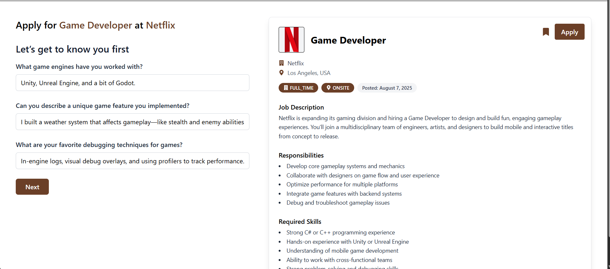  
Before you can proceed to the next step, you must answer all screening questions. The **Next** button remains disabled until all questions are answered.

## 13. Application Process – Part 2
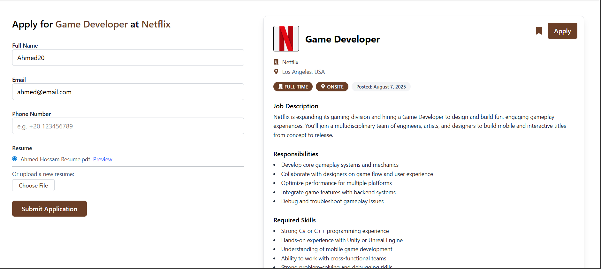  
In this step, you provide your **Name** and **Email** (for receiving updates), and optionally a **Phone Number**.  
You also choose a **Resume**:
- Use your already uploaded resume by keeping the selected option.
- Upload a new resume if you don’t want to use the one provided at sign-in.

## 14. Submitted Application
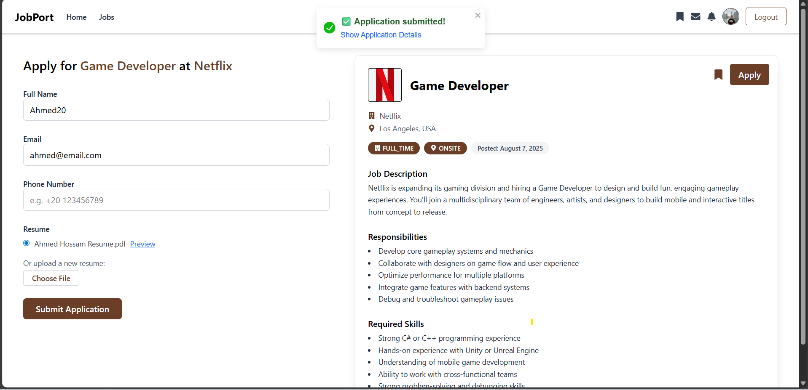  
Once the application is submitted:
- A success pop-up appears confirming submission.
- You can view the application details.
- You **cannot submit another application** for the same job.

## 15. Application Details
  
A read-only page showing:
- Job you applied to
- Resume URL (clickable for verification)
- Application status (**Pending** immediately after submission)

## 16. Applying for a Meta Job
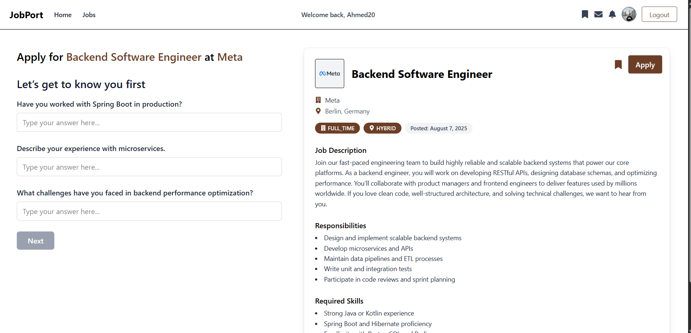  
An example of applying for another role at **Meta** (Backend Software Engineer) following the same process as the Netflix role.

## Notifications

### NotificationPopUp & NotificationCloserLook
  
  

When I logged in again after a while, after my application status had changed, I received a **notification pop-up** showing updates for two applications:  
- **Netflix** → Accepted  
- **Airbnb** → Rejected  

Each pop-up included:  
- Company logo  
- Job title & company name  
- Updated application status  
- A **"Mark as Read"** button  

### NotificationFromBell
  

You can view notifications again by clicking on the **bell icon** in the navbar.  
This opens a dropdown showing:  
- Notification message  
- Option to mark each notification as read  

### MarkAsRead
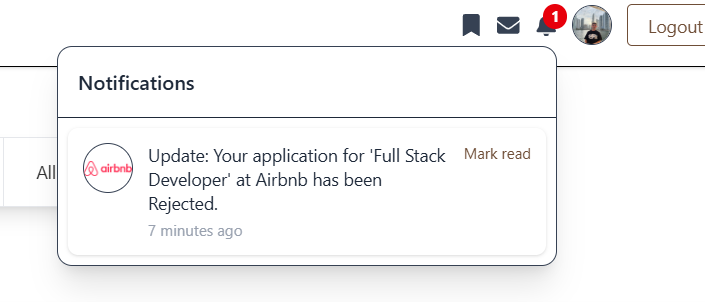  

When I marked the **Netflix** notification as read:  
- It was removed from the bell notification list  
- Only the remaining **Airbnb** notification was displayed  

## Employer

### EmployerSignUp
  

When I choose to sign up as an **Employer**, these fields appear:  
- Name of employer account  
- Username and password (used for login)  
- Company name (visible to job seekers)  
- Industry (e.g., Tech, Social Media, etc.)  
- Email  
- Company logo  

---

### FilledEmployerSignUpModal
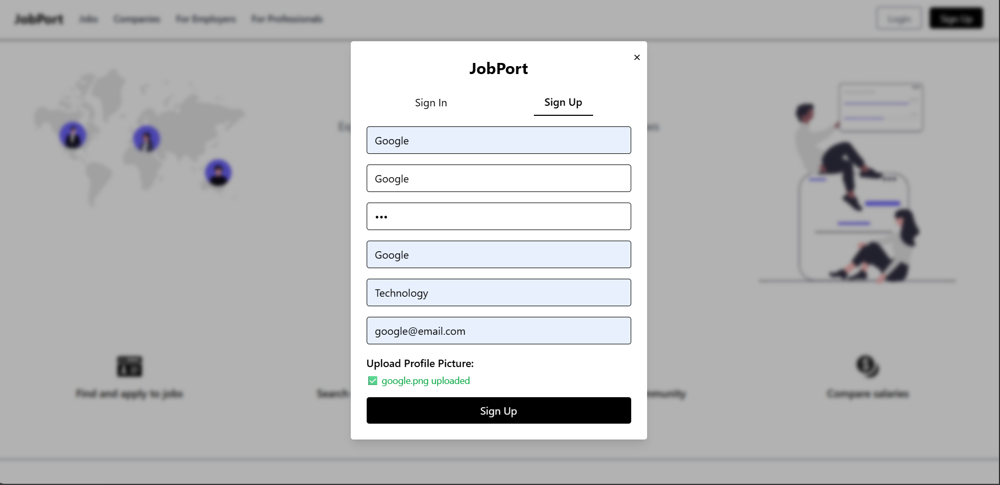  

Here I have filled in the required information and uploaded the **company logo**.  
This logo will be displayed whenever I post jobs.  

---

### SignUpSuccessfully
  

After signing up successfully:  
- A **toast notification** confirms the signup was completed without any problems.  
- I am automatically redirected to the **Sign In** tab in the modal.  

---

### DashboardGoogle
  

This is the **Employer Dashboard**, the first landing page after signing in.  
- Initially, it is empty because I have not added any jobs or received any applications yet.  
- A later version will show a **filled dashboard** with jobs and applications.  

## Creating a Job

### CreatingJob
  

After signing in with my Google account, I start creating a job.  
The first step is entering the **Job Title** and **Description**.  

---

### CreatingJob1
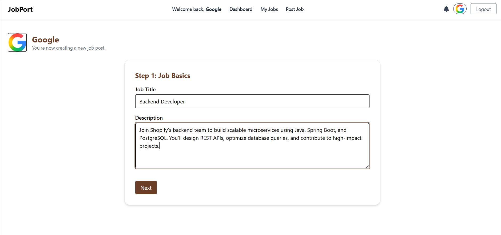  

Filling in the **Job Title** and **Job Description** fields.  

---

### CreatingJob2
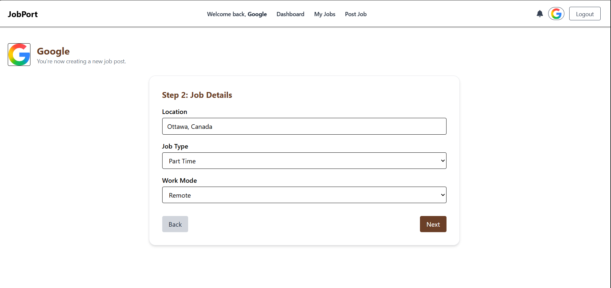  

Filling in:  
- **Location**  
- **Job Type** (Part-time, Full-time, Internship)  
- **Work Mode** (Hybrid, Remote, On-site)  

---

### CreatingJob3
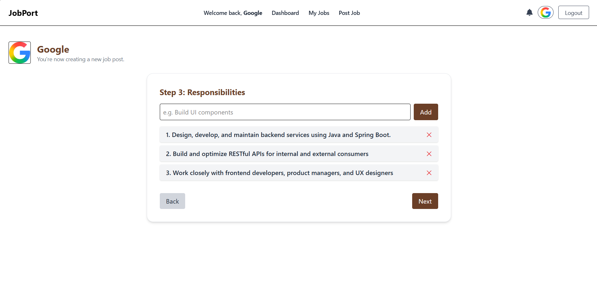  

Adding **Job Responsibilities** as a list.  
- You can remove any responsibility if added by mistake.  

---

### CreatingJob4
  

Adding the **Required Skills** for the job.  

---

### CreatingJob5
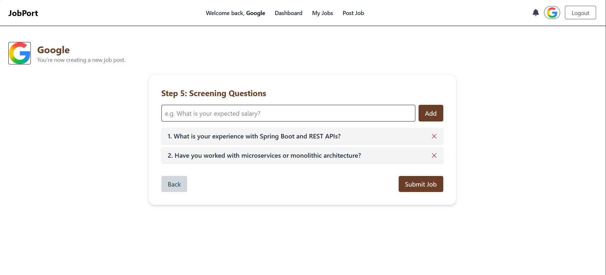  

Adding **Screening Questions** (optional).  
- You can skip this step if not needed.  

---

### CreatingJobSuccessfully
  

The job is created successfully.  
You can:  
- **View the job details**  
- **Add another job**  

---

### CreatedJobDetails
  

After creation, the job details page allows you to:  
- View all job information  
- **Update** the job  
- **Delete** the job  

---

### DeletingJob
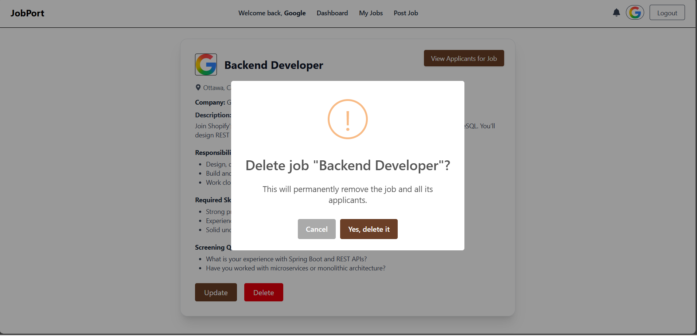  

When deleting a job:  
- An info message appears, warning that this will also remove all applicants for the job.  
- You can confirm (**Yes**) or cancel the deletion.  

## Managing Jobs & Viewing Applicants

### JobCreatedInMyJobs
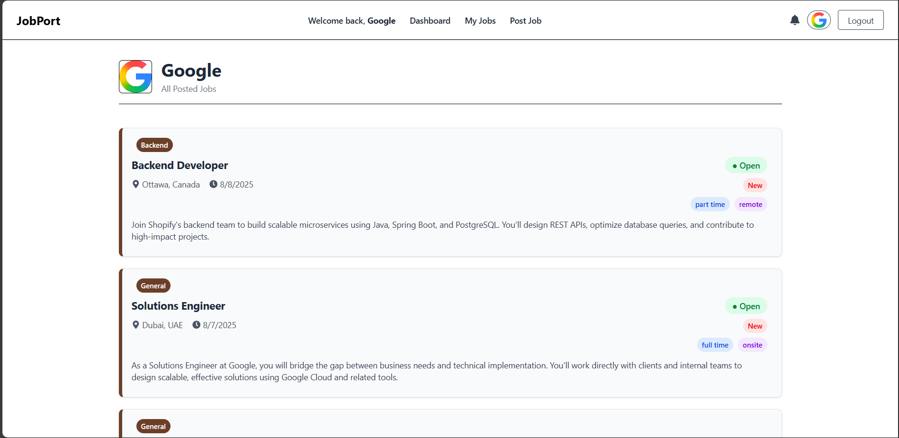  

You can see the newly created job in the **My Jobs** tab.  
Example: **Backend Developer**.  

---

### JobDetails
  

When clicking on any job, the **Job Details Card** appears.  
From here, you can:  
- **Update** the job  
- **Delete** the job  
- **View applicants** for this job  

---

### UpdatingJob
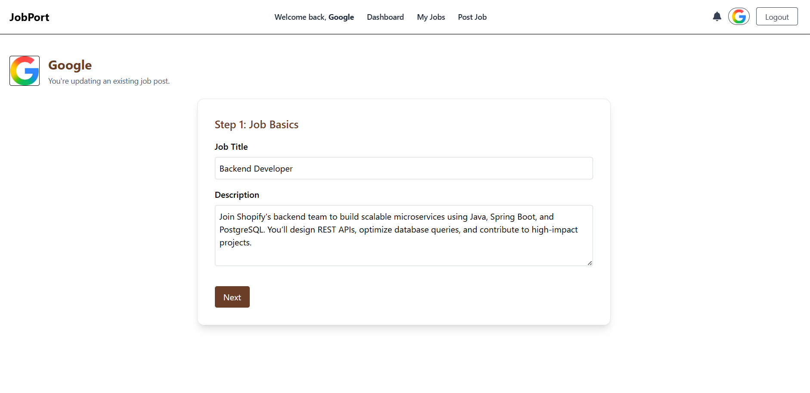  

When selecting **Update Job**, you can modify any section of the job listing.  

---

### UpdatingJob1
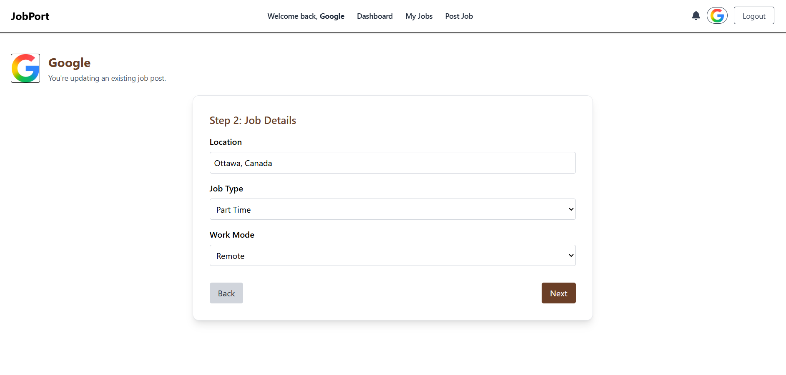  

In this example, I updated the **Job Type** from **Part-time** to **Full-time**.  

---

### UpdatingJob2
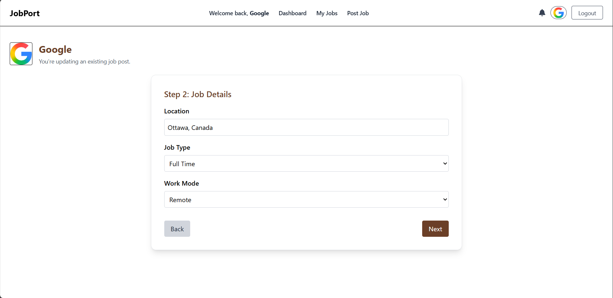  

Confirmation of the updated job type to **Full-time**.  

---

### UpdatingJob3
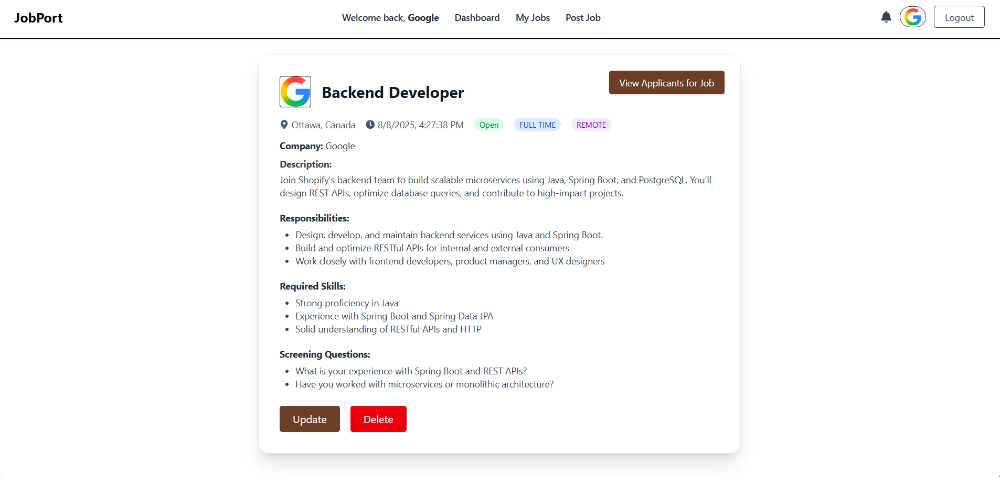  

The job type is now successfully changed to **Full-time**.  

---

### DashboardGoogleAfterAddingJobs
  

The **Dashboard** after adding several jobs:  
- **Jobs count:** 6  
- **Total applicants:** 19  
- All applicants are currently **pending** (none accepted or rejected yet).  

---

### DashboardGoogleApplicants
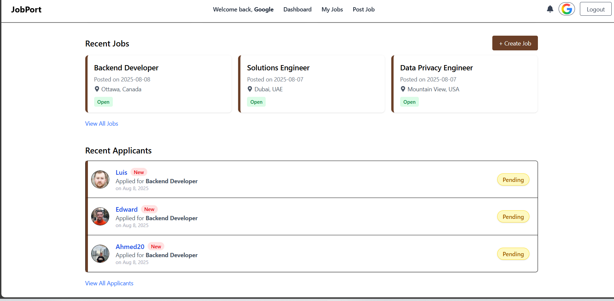  

Displays the **most recent applicants** and the roles they applied for.  

---

### ViewingApplicants
  

### ViewingApplicants2
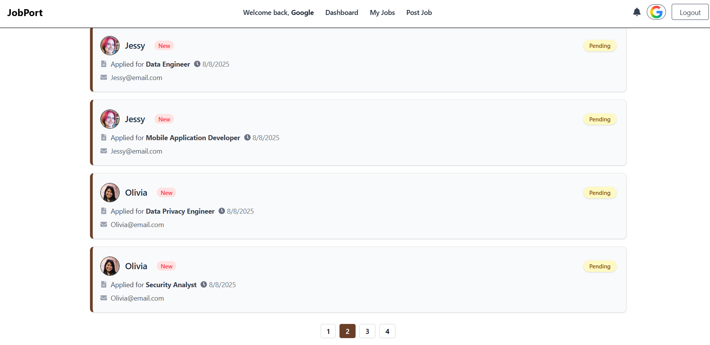  

### ViewingApplicants3
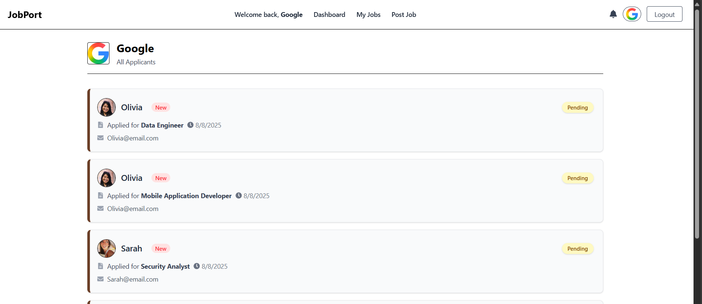  

These three screenshots show the **applicants for different job roles**.  
Each job has its own set of applicants, with their application details listed.  

## Viewing & Managing Applications

### ViewingSpecificApplication
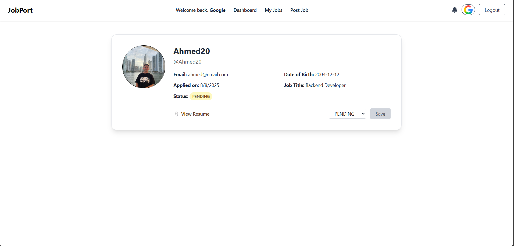  

As an employer, you can click on any application to:  
- View applicant details  
- View the applicant's resume  
- Change the application status to **Accepted** or **Rejected**  

---

### ViewingApplicationDetails
  

Example: Viewing **Sarah's** application.  
The card displays:  
- Role she is applying for  
- Her personal details  
- A clickable **resume link**  

---

### AcceptingAnApplicant
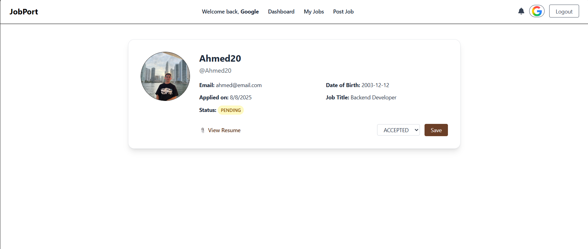  

After reviewing the resume, the employer accepts the applicant.  

---

### StatusChangedToAccepted
  

The application status changes to **Accepted**.  
The applicant will be **notified** of this update.  

---

### RejectingAnApplicant
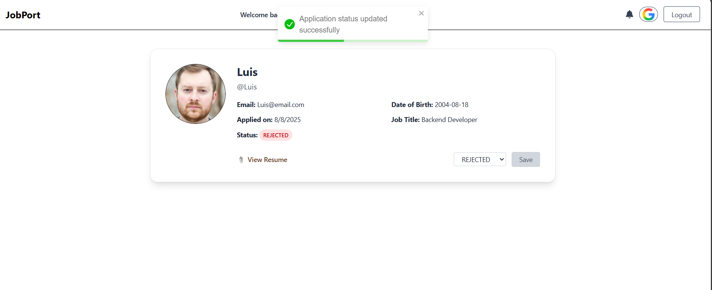  

The employer rejects an applicant.  
The application status changes to **Rejected**.  

---

### DashboardAfterAcceptingAndRejecting
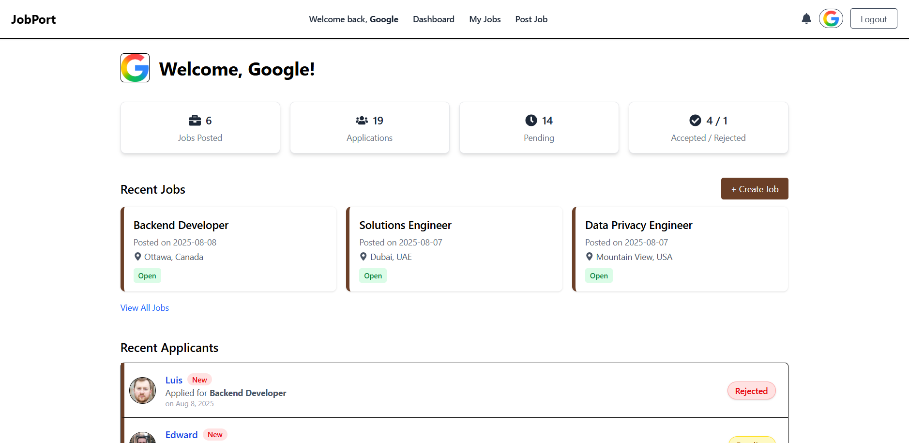  

The dashboard after accepting and rejecting some applicants.  

---

### ApplicantsForASpecificJob
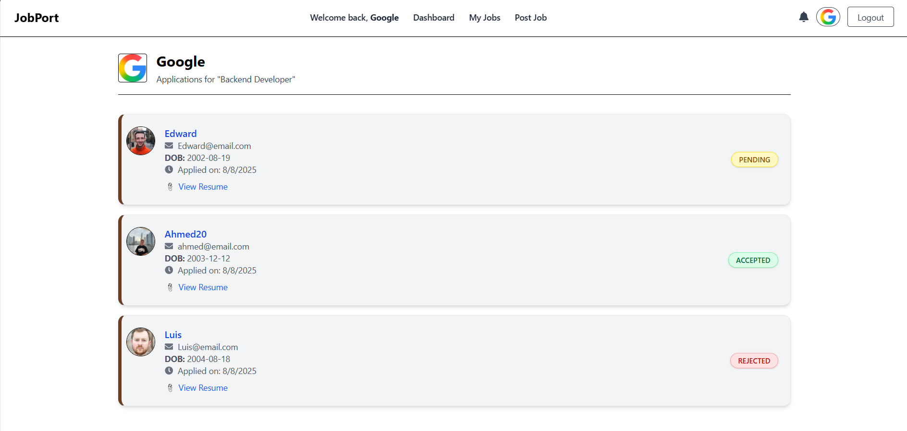  

You can view applicants for a **specific job** by navigating to the **Job Details** page.  
This list shows **only** the applicants who applied for that job.  

## 📂 Project Structure

